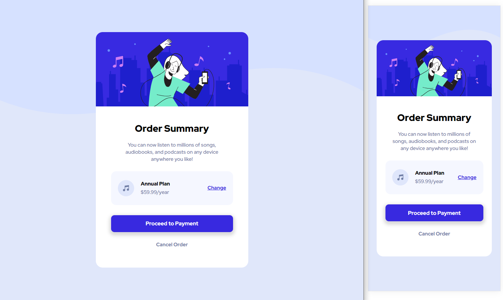

# html-css-toy-projects

## html, css projects

with a little bit of JavaScript  

Mini projects just for practice  

### Card (Finished on 2022-02-28)

- Design : choiiis
- HTML, CSS
- Practice Skills : flex, transition, transform
- Blog Post : [HTML CSS Toy Project : Hover Cards](https://velog.io/@choiiis/HTML-CSS-Toy-Project-Hover-Cards)

### Order Summary (Finished on 2022-03-04)

- Design : [https://www.frontendmentor.io/challenges/order-summary-component-QlPmajDUj](https://www.frontendmentor.io/challenges/order-summary-component-QlPmajDUj)
- HTML, CSS
- Practice Skills : mobile responsive, flex, aligning image
- Blog Post : [HTML CSS Toy Project : Order Summary](https://velog.io/@choiiis/HTML-CSS-Toy-Project-Order-Summary)

### Spotlight (Finished on 2022-03-27)

- Design : choiiis
- HTML, CSS, Javascript
- Practice Skills : Event Listener, Mouse move, Radial gradient
- Blog Post : [마우스를 따라 움직이는 조명 효과 구현하기](https://choiiis.github.io/web/how-to-make-spotlight-focus/)

### Overwatch Characters (Finished on 2022-04-07)

- Design : [Heropy (FastCampus 강의 예제)](https://github.com/ParkYoungWoong)
- HTML, SCSS
- Practice Skills : SCSS
